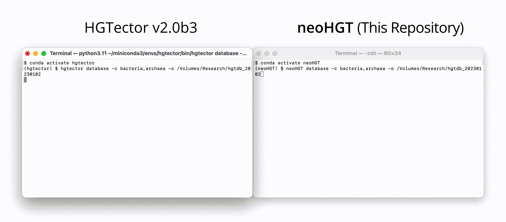

<p align="center">
	<a href="https://github.com/neoLIZV/neoHGT">
		
	</a><br>
</p>

# neoHGT2: 🧬 Horizontal Gene Transfer

Updated on April 2023.

To see the previous version neoHGT1, you may find it [here](https://www.github.com/cgneo/neoHGT).


## Table of Contents
1. [About](#about)
2. [Installation](#installation)
3. [Database](#database)
4. [Compiling](#compiling)
5. [Search](#search)
6. [Analyze](#analyze)
7. [Uninstall](#lastly)
8. [License](#license)

## About
**neoHGT** can predict the horizontal/lateral gene transfer (HGT) for species of interest. This open-source project is based on [HGTector](https://github.com/qiyunlab/HGTector) developed by Qiyun lab, but the difference is that I have fixed some known bugs, optimized the downloading process by leveraging multi-processing, and improving the overall stability of the software.

  

## Installation
The project is written entirely in Python3.<br>
Recommended installation method:

Step 1/3:

```
conda create -n neoHGT -c conda-forge python=3 pyyaml pandas matplotlib scikit-learn
```

Step 2/3:

Next, you will need to manually install diamond by visiting [the official conda webpage](https://anaconda.org/bioconda/diamond/files?version=0.9.26).

You will see a list of files, please look at the begining of the filename, which describes the operating system. After downloading the one that corresponds to your system, you can run

```
conda activate neoHGT
```
```
conda install <diamond___.tar.bz2>
```

followed by the file you just downloaded (dragging the file to your teminal) to install diamond.

Step 3/3:

Run the following command:

```
conda activate neoHGT
```
```
pip install git+https://github.com/neoLIZV/neoHGT.git
```


## Database



Compared to HGTector, neoHGT not only fixes some known bugs of HGTector but also uses multi-processes to enable parallel downloading, saving you time on the database downloading process.

neoHGT also provides ```server.py``` to help you download and install the database without Graphical User Interface.

But the recommended way is to download manually:

## Option1 (Manual)
### (Most comprehensive and most up-to-date but time-consuming):

First, we need ```taxonmap```, where you have two options to obtain the file(s):

This following link will produce a smaller, more compact ```taxdump``` (around 0.4GB after decompression). You can paste the link on your broswer to start downloading:
```
https://ftp.ncbi.nlm.nih.gov/pub/taxonomy/taxdump.tar.Z
```

This following link will produce the latest, more comprehensive ```taxdump``` (around 1.8GB after decompression):

```
https://ftp.ncbi.nlm.nih.gov/pub/taxonomy/new_taxdump/new_taxdump.tar.Z
```

___

Next, we will need ```prot.accession2taxid```, and there are two options:

This following link will produce a smaller, more compact ```prot.accession2taxid``` (around 7GB). You can paste the link on your broswer to start downloading:

```
https://ftp.ncbi.nlm.nih.gov/pub/taxonomy/accession2taxid/prot.accession2taxid.gz
```

This following link will produce the latest, more comprehensive ```prot.accession2taxid``` (around 12GB):

```
https://ftp.ncbi.nlm.nih.gov/pub/taxonomy/accession2taxid/prot.accession2taxid.FULL.gz
```

## Option2 (Manual):
### (Time-saving but less comprehensive and less up-to-date)

There exists a pre-built database on [this OneDrive link](https://arizonastateu-my.sharepoint.com/personal/qzhu44_asurite_asu_edu/_layouts/15/onedrive.aspx?id=%2Fpersonal%2Fqzhu44%5Fasurite%5Fasu%5Fedu%2FDocuments%2FPublic%2FHGTector) where you can just download the latest ```hgtdb___.tar.xz``` file, and you can skip the database compiling steps and jump to the [Compiling](#compiling) step.

___

## Database downloading

After obtaining ```taxonmap``` and ```prot.accession2taxid```, we will need to run ```neoHGT database``` command to download around 291,000 genome files to build the diamond database (~90GB) depending on how many categories you have chosen.

The command that I used to build the database is:

```
neoHGT database -c bacteria,archaea,viral -o <FOLDER_NAME>
```

where ```-c``` or equivalently ```-cats``` means category.

This following table explains the command and options available for you to build a customized database.

| Command | Options |
|---------|---------|
| -c (-cats)      | archaea, bacteria, fungi, invertebrate, metagenomes, mitochondrion, plant, plasmid, plastid, protozoa, unknown, vertebrate_mammalian, vertebrate_other, and viral (derived from the [folder names of NCBI RefSeq database](https://ftp.ncbi.nlm.nih.gov/genomes/refseq/)) |
| -o      | Output database directory |

___

Known issue:

Don't panic if you see this error message:
```
File "/Users/___/miniconda3/envs/neoHGT/lib/python3.11/site-packages/neoHGT/database.py", line 351, in get_categories
    raise ValueError(
ValueError: "___" is not a valid RefSeq genome category
```

This error occurs either when you typed a category with a wrong name (for example ```virus``` folder does not exist on NCBI server, you should type ```viral``` instead) or when the NCBI server has temporarily shuted-down the connection from you (refused your connection). There is nothing wrong with the program itself.

The best thing you can do when having this error is to test your connection by entering the following command to the terminal:

```
rsync --list-only --no-motd rsync://ftp.ncbi.nlm.nih.gov/genomes/refseq/
```

If you see something like ```rsync: failed to connect to ftp.ncbi.nlm.nih.gov: Connection refused (61)
rsync error: error in socket IO (code 10)```, it confirms that, indeed, there is a network issue (likely from the NCBI server side).

Otherwise, if the previous command returns you a list that starts with ```drwxr-sr-x```, followed by something like ```lrwxrwxrwx```, it means the connection is restored, and you can safely execute the program again.

For more advanced options such as excluding specific taxids, please refer to HGTector's [Database](https://github.com/qiyunlab/HGTector/blob/master/doc/database.md) documentation.

After seeing the program finished with
```
✅ Done
Combined protein sequences written to db.faa.
```
it means that you can proceed with manual compiling.

___

## Compiling

I will only be using Diamond because it is optimized and faster.

### If you followed the instructions of <b>Option1</b>:

```
cd <DATABASE_DIRECTORY>
```

```
mkdir diamond
```

And then carefully replace the entry with ```<‼️>``` with the files you downloaded and extracted. Make sure the files are all under the root folder of your ```<DATABASE_DIRECTORY>```. Below, I used several lines to make things clear, but in practice you should stick to one line without pressing the ```return``` key.

```
diamond makedb --threads 64 --in db.faa
--taxonmap <‼️prot.accession2taxid.FULL>
--taxonnodes <‼️taxdump>/nodes.dmp
--taxonnames <‼️taxdump>/names.dmp
--db diamond/db
```

### If you followed the instructions of <b>Option2</b>:

Step 1/2:

```
cd <DATABASE_DIRECTORY>
```

```
echo $'accession.version\ttaxid' | cat - <(zcat taxon.map.gz) > prot.accession2taxid.FULL
```
In this step, you may encounter a strange error like ```zcat: can't stat: taxon.map.gz (taxon.map.gz.Z): No such file or directory```. If you see this, just simply rename the ```taxon.map.gz``` file into ```taxon.map.gz.Z```.

Step 2/2:

Make sure you are still in the ```<DATABASE_DIRECTORY>```, then enter the following command:

```
mkdir diamond
```
```
diamond makedb --threads 64 --in db.faa --taxonmap prot.accession2taxid.FULL --taxonnodes taxdump/nodes.dmp --taxonnames taxdump/names.dmp --db diamond/db
```

## Search

The following approach is considered "safer" as you will manually execute the search using ```diamond``` or ```blastp```, which can reduce the chances of bugs due to third-libray support (on diamond for example).

Step 1/3:

```
conda activate neoHGT
```

Step 2/3:

(Below, I used several lines to make things clear, but in practice you should stick to one line without pressing the ```return``` key)

```
diamond blastp
--query <input_file.faa>
--db <diamond_db>
--outfmt 6 qseqid sseqid pident evalue bitscore qcovhsp staxids
> <output_directory>/result.txt
```

Step 3/3:

```
neoHGT search -i <input_file.faa>
-m precomp -s <output_directory>/result.txt
-t <taxdump_dir>
-o <output_directory>
```

Checkout the ```.tsv``` file in your ```<output_directory>```, and if it's non-empty, you can proceed to the [Analyze](#analyze) step.

___

If for some reasons ```diamond``` doesn't work, the alternative will be ```blastp```, which can be found [here](https://blast.ncbi.nlm.nih.gov/doc/blast-help/downloadblastdata.html). But first, you will need to compile blastp database by following this [artilce](https://www.ncbi.nlm.nih.gov/books/NBK569841/).

The command to make blast database is more or less the following:

```
makeblastdb -parse_seqids -in db.faa
-out <blast_db_path>/<name_of_db>
-title <name_of_db>
-taxid_map <taxon.map>
```

Here the taxon.map file can be obtained by running:

```
gunzip -k taxon.map.gz
```

Then, enter the following command:

```
blastp -query <input_file.faa>
-db <blast_db_path>/<name_of_db>
-outfmt "6 qaccver saccver pident evalue bitscore qcovhsp staxids"
> <output_directory>/result_blast.txt
```

And lastly, 

```
neoHGT search -i <input_file.faa>
-m precomp -s <output_directory>/result_blast.txt
-t <taxdump_dir>
-o <output_directory>
```

Checkout the ```.tsv``` file in your ```<output_directory>```, and if it's non-empty, you can proceed to the [Analyze](#analyze) step.

___

Apart from the manual approach, this following command will perform the search process all in one place, but it is not recommended because a known compatibility bug was discovered and confirmed due to the dependency upgrade of ```diamond```:

```
neoHGT search -i <input_file.faa.gz> -o . -m diamond -p 32 -d <diamond_db> -t <taxdump_dir>
```

To see more details, please refer to [HGTector's issue page](https://github.com/qiyunlab/HGTector/issues/114).

## Analyze

The command for analyzing the obtained ```.tsv``` file is:

```
neoHGT analyze -i <output.tsv>  -t <taxdump_dir> -o <output_dir>
```

neoHGT changed the output format of the graph from `.png` to `.pdf` for better resolution and publication purposes.

To perform analysis, please refer to [HGTector's Analyze](https://github.com/qiyunlab/HGTector/blob/master/doc/analyze.md) documentation.


## Lastly

To uninstall, you may run:
```
conda remove -n neoHGT --all
conda uninstall bioconda
```

For comprehensive guideline, please refer to [HGTector's Installation](https://github.com/qiyunlab/HGTector/blob/master/doc/install.md) for full information.


## Publication

This repository was a result of my internship at LOB - Laboratoire d'Optique et Biosciences, where we published a paper on [Nature Communication](https://www.nature.com/articles/s41467-023-36487-z).

> Filée, J., Becker, H. F., Mellottee, L., Eddine, R. Z., Li, Z., Yin, W., Lambry, J.-C., Liebl, U., & Myllykallio, H. (2023, February 15). Bacterial origins of thymidylate metabolism in Asgard Archaea and Eukarya. Nature Communication. Retrieved February 18, 2023, from https://www.nature.com/articles/s41467-023-36487-z


## Works cited

> Zhu Q, Kosoy M, Dittmar K. HGTector: [an automated method facilitating genome-wide discovery of putative horizontal gene transfers](https://bmcgenomics.biomedcentral.com/articles/10.1186/1471-2164-15-717). *BMC Genomics*. 2014. 15:717.


## License

Copyright (c) 2023-, [neoLIZV](https://github.com/neoLIZV). Licensed under [BSD 3-clause](http://opensource.org/licenses/BSD-3-Clause).

Copyright (c) 2013-, [Qiyun Zhu](mailto:qiyunzhu@gmail.com) and [Katharina Dittmar](mailto:katharinad@gmail.com). Licensed under [BSD 3-clause](http://opensource.org/licenses/BSD-3-Clause). See full license [statement](LICENSE).
